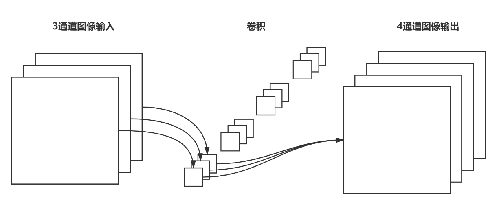

# tf-pose_Client

>本项目是对`tf-pose`项目的封装，使用tkinter制作一个客户端，并在原有骨架识别的基础上，使用平面几何的算法进行姿态识别（基本没啥用）。
>
>`tf-pose`项目即使用Tensoflow实现的Openpose项目。
>
>使用前请先克隆`tf-pose`的主体代码https://github.com/binaryacademy/tf-pose-estimation.git。
>
>然后将本项目的`client`文件夹拷贝至刚刚克隆的项目内即可，运行`/client/main.py`即可使用。

## 效果图


## 主要功能

- 保存几帧内该人物的所有骨架为图片，img文件夹下

  

- 保存一帧内人物骨架节点信息，pose文件夹下

  ```json
  BodyPart:0-(0.77, 0.23) score=0.80 
  BodyPart:1-(0.77, 0.30) score=0.63
  BodyPart:2-(0.70, 0.29) score=0.57 
  BodyPart:3-(0.65, 0.29) score=0.78 
  BodyPart:4-(0.71, 0.28) score=0.66 
  BodyPart:5-(0.85, 0.30) score=0.52 
  BodyPart:6-(0.89, 0.40) score=0.53 
  BodyPart:7-(0.91, 0.48) score=0.39 
  BodyPart:8-(0.73, 0.52) score=0.20 
  BodyPart:9-(0.73, 0.69) score=0.19 
  BodyPart:10-(0.72, 0.80) score=0.25 
  BodyPart:11-(0.83, 0.49) score=0.29 
  BodyPart:12-(0.81, 0.69) score=0.10 
  BodyPart:13-(0.78, 0.78) score=0.32 
  BodyPart:14-(0.75, 0.22) score=0.88 
  BodyPart:15-(0.79, 0.22) score=0.84 
  BodyPart:16-(0.72, 0.23) score=0.62 
  BodyPart:17-(0.81, 0.23) score=0.69
  ```
  

## 深度可分离卷积

由于`tf-pose`项目中的卷积神经网络大量使用到了深度可分离卷积（Depthwise Separable Convolution），因此简单介绍一下此卷积。


深度可分离卷积层将传统卷积分为了深度可分卷积（Depthwise Convolution）和逐点可分卷积（Pointwise Convolution）。深度可分卷积不同于传统卷积，在传统卷积中，每一个通道都可对应多个卷积核，因此输出的通道数可以与输入图像通道数不一致。并且输出图像的每一个通道都是由输入图像的每一个通道与卷积核卷积而来。但是，在深度可分卷积中，一个卷积核对应着一个通道，这个通道既是输入图像的通道又是输出图像的通道，因此输出的图像通道数与输入图像相同。下左图为传统卷积，下右图为深度可分卷积：


逐点可分卷积与传统卷积又十分相似，不过卷积核的宽度和高度都为1，即是一个1×1×输入通道数×输出通道数的卷积，并且输出的通道数可以与输入通道数不一致。传统卷积的示意图如图3-1所示，逐点卷积的示意图如下图所示：



除了上述的两个卷积之外，深度可分离卷积层还包括批标准化层（BN: Batch Normalization）和激活层，在激活层中一般使用ReLU（Rectified Linear Unit，线性整流函数）作为激活函数。因此，一个深度可分离卷积层可以被表示为如下结构：


## 姿态识别

本系统采用的姿态识别是基于一段时间内的人体骨架信息，经过数学算法计算出来的大概率动作。本文主要识别了人体的抬手动作，其余身体动作也大致相同。通过获取人体肩部、手肘、手腕的关键点坐标，并将其映射为两个向量，如下所示：


因此，通过计算向量A与向量B的夹角，就可以知道人体手臂的弯折情况，当夹角越小时，两向量的夹角的余弦值也就越大，以此证明人体的手臂是伸直状态，两向量的夹角计算公式如下：


除了证明手臂处于伸直状态之外，还需要计算手臂是否处于抬起状态，即手臂是否处于水平状态，因此需要算出手臂与水平方向的夹角是否足够小。为了减小误差，本文取经过单位化后的向量A与单位化后的向量B的合成向量代表手臂的趋势方向，为向量C，计算公式如下所示：


通过计算向量C与水平方向夹角的余弦，来判断人体手臂是否处于抬起的状态。通过设定合理的阈值，来表示当夹角的余弦超过此阈值时则视为夹角足够小。为了更好的减小误差，本系统采用对人体5帧内的骨架信息进行如上处理，并对获得到的夹角余弦信息进行求平均处理，再与阈值相比较。当上述两个夹角都满足要求时，即视为人体抬手。本系统选用的阈值为0.6，其核心代码如下：

```python
# 计算向量A与向量B夹角是否足够小
flg_1 = False
if np.mean(vector_A_B) > 0.6:
    flg_1 = True
# 计算向量C是否与水平方向夹角足够小
flg_2 = False
if np.mean(vector_C[vector_C>=0]) > 0.6 or np.mean(vector_C[vector_C<=0]) < -0.6:
    flg_2 = True
# 当满足上述两个条件时，才返回真
return flg_1 and flg_2
```