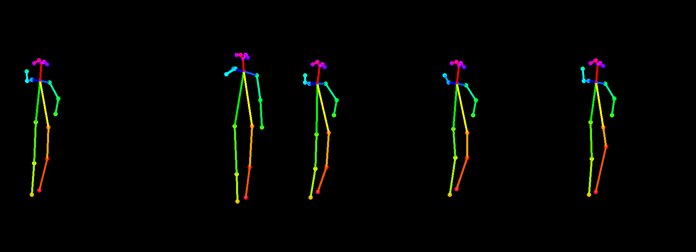

# tf-pose_Client

>本项目是对`tf-pose`项目的封装，使用tkinter制作一个客户端，并在原有骨架识别的基础上，使用平面几何的算法进行姿态识别（基本没啥用）。
>
>`tf-pose`项目即使用Tensoflow实现的Openpose项目。
>
>使用前请先克隆`tf-pose`的主体代码https://github.com/binaryacademy/tf-pose-estimation.git，然后将本项目的`client`文件夹拷贝至刚刚克隆的项目内即可，运行`/client/main.py`即可使用。

## 效果图


## 主要功能

- 保存几帧内该人物的所有骨架为图片，img文件夹下

  

- 保存一帧内人物骨架节点信息，pose文件夹下

  ```json
  BodyPart:0-(0.77, 0.23) score=0.80 
  BodyPart:1-(0.77, 0.30) score=0.63 
BodyPart:2-(0.70, 0.29) score=0.57 
  BodyPart:3-(0.65, 0.29) score=0.78 
  BodyPart:4-(0.71, 0.28) score=0.66 
  BodyPart:5-(0.85, 0.30) score=0.52 
  BodyPart:6-(0.89, 0.40) score=0.53 
  BodyPart:7-(0.91, 0.48) score=0.39 
  BodyPart:8-(0.73, 0.52) score=0.20 
  BodyPart:9-(0.73, 0.69) score=0.19 
  BodyPart:10-(0.72, 0.80) score=0.25 
  BodyPart:11-(0.83, 0.49) score=0.29 
  BodyPart:12-(0.81, 0.69) score=0.10 
  BodyPart:13-(0.78, 0.78) score=0.32 
  BodyPart:14-(0.75, 0.22) score=0.88 
  BodyPart:15-(0.79, 0.22) score=0.84 
  BodyPart:16-(0.72, 0.23) score=0.62 
  BodyPart:17-(0.81, 0.23) score=0.69
  ```
  
  

